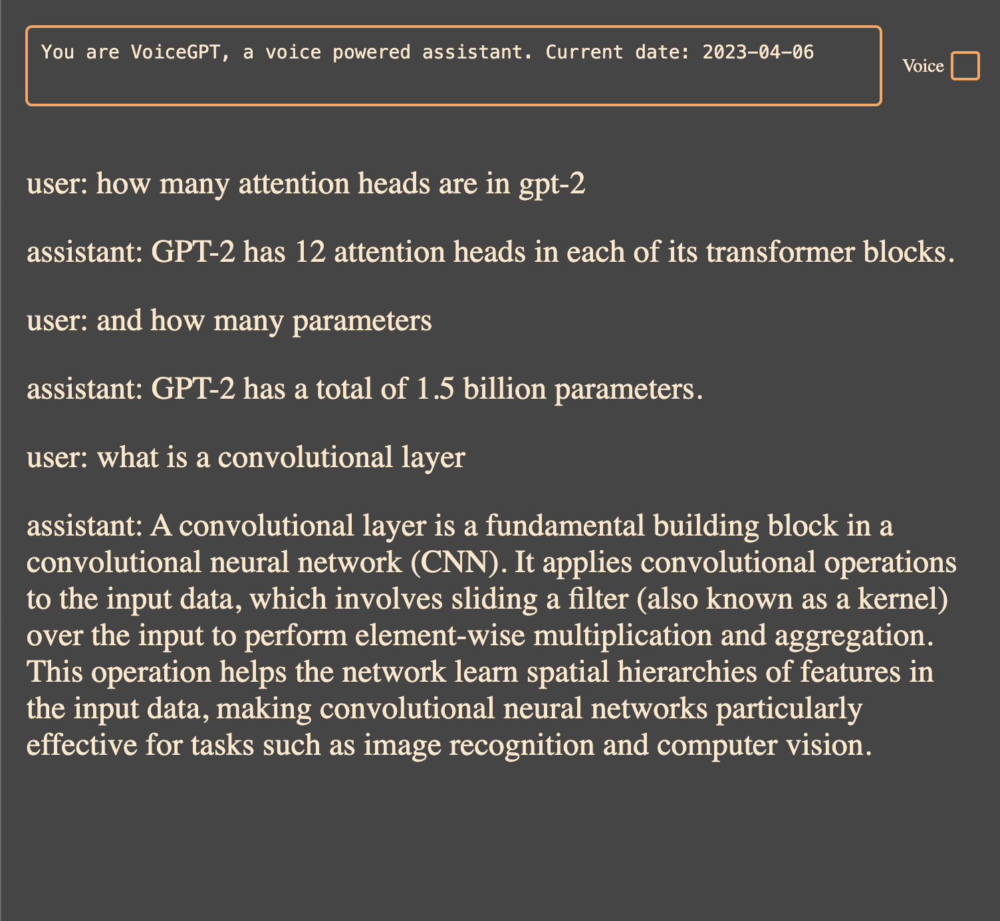

# GPT3.5 / 4 Voice Interface

This is a simple Node.js application that allows you to interact with GPT3.5 / 4 verbally. 
It was originally created before OpenAI released a voice interface in the ChatGPT app. 
Earlier versions of this project used the Whisper model locally and a hacky utterance detection with FFmpeg for voice to text. However, it now utilizes the browser's built-in voice to text and speech synthesis, which is good enough for the purpose.

## Getting Started

To run the application, follow these steps:

1. Rename `.env.example` to `.env` in the root directory of the project and add your OpenAI API key.
2. Install the required dependencies by running `npm install`.
3. Start the application by running `node main.js`.

Please note that you need to have a valid OpenAI API key to use this application.

## Usage

Once the application is running, you can interact with GPT3.5 / 4 verbally. The application will convert your voice input to text using the browser's voice to text feature and then use the OpenAI API to generate a response. Optionally enable TTS and have the AI response spoken back to you.

## License

This project is licensed under the [MIT License](LICENSE).